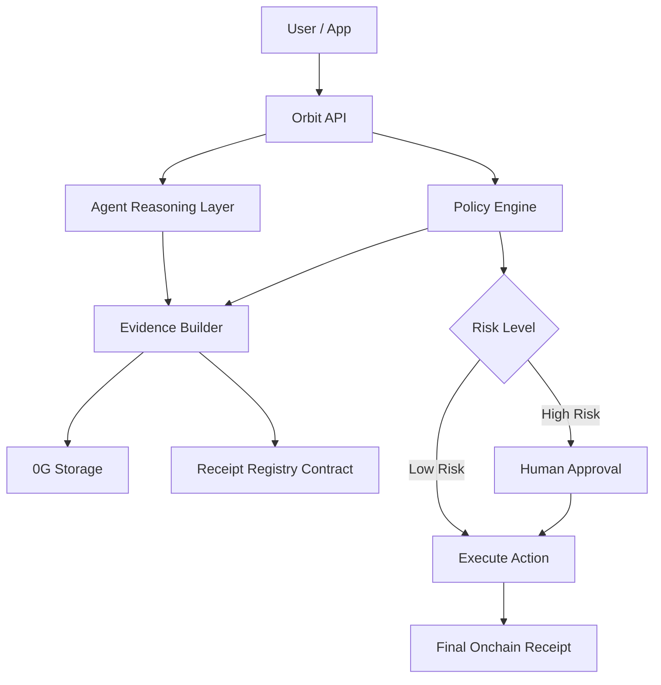

# Orbit

**Execution infrastructure for AI agents on 0G**

Orbit is a trust and execution layer for autonomous agents.  
It standardizes how AI agents reason, act, store evidence, and leave verifiable receipts onchain.

## One-liner

**Orbit helps AI agents execute real actions with policy controls, evidence storage, and onchain receipts.**

## Problem

AI agents are getting better at reasoning, but they still face major trust problems when moving from **suggestion** to **execution**.

Current pain points:

- AI agents can recommend actions, but users do not trust them to execute autonomously
- Agent decisions are often black boxes with weak auditability
- Tool calls, model outputs, and execution history are fragmented
- There is no standard execution receipt for agent workflows
- High-value actions need policy enforcement before execution
- Developers lack a reusable middleware layer for agent observability and settlement

In short:

> AI agents can think, but they still cannot safely act in a verifiable way.

## Solution

Orbit is an **execution middleware for AI agents**.

It sits between the agent runtime and the final action layer, and provides:

- **Policy checks** before execution
- **Evidence bundling** for model outputs and tool calls
- **0G Storage integration** for logs, traces, and memory snapshots
- **Onchain receipts** for important actions
- **Human-in-the-loop approval** for risky operations

Orbit makes agent actions:

- **auditable**
- **traceable**
- **policy-controlled**
- **verifiable**

## Why 0G

Orbit is built around the 0G stack:

- **0G Storage** stores execution logs, tool outputs, memory snapshots, and evidence bundles
- **0G Compute** can be used for agent inference and reasoning
- **0G DA** supports large evidence availability for AI workflows
- **0G Chain** records verifiable execution receipts and policy-linked actions

This makes 0G a natural fit for trusted agent infrastructure.

## MVP Scope

For the hackathon, Orbit focuses on a simple but high-impact flow:

### Target Users

Orbit is designed for:

- agent developers
- AI workflow builders
- crypto-native teams
- treasury automation tools
- onchain AI applications
- autonomous service platforms

## User Flow

### Flow A: Low-risk request

1. User submits payment request
2. Orbit policy engine evaluates request
3. AI agent returns low-risk recommendation
4. Orbit generates evidence bundle
5. Evidence bundle is stored in 0G Storage
6. Receipt hash is written onchain
7. Payment executes automatically
8. User sees final status and receipt

### Flow B: High-risk request

1. User submits payment request
2. Orbit detects policy violation or high risk
3. AI agent recommends manual review
4. Orbit stores evidence bundle in 0G Storage
5. Orbit writes pending receipt onchain
6. Human reviewer approves request
7. Orbit executes payment
8. Final receipt is recorded

## Core Features

### Policy-Controlled Execution

Every agent action must pass pre-defined policy checks.

### Verifiable Evidence

Every important decision creates a structured evidence bundle.

### Onchain Receipts

Every important action leaves a verifiable receipt onchain.

### Modular Middleware

Orbit is not tied to a single agent framework. It can become a reusable execution layer for many agent systems.

## Architecture

